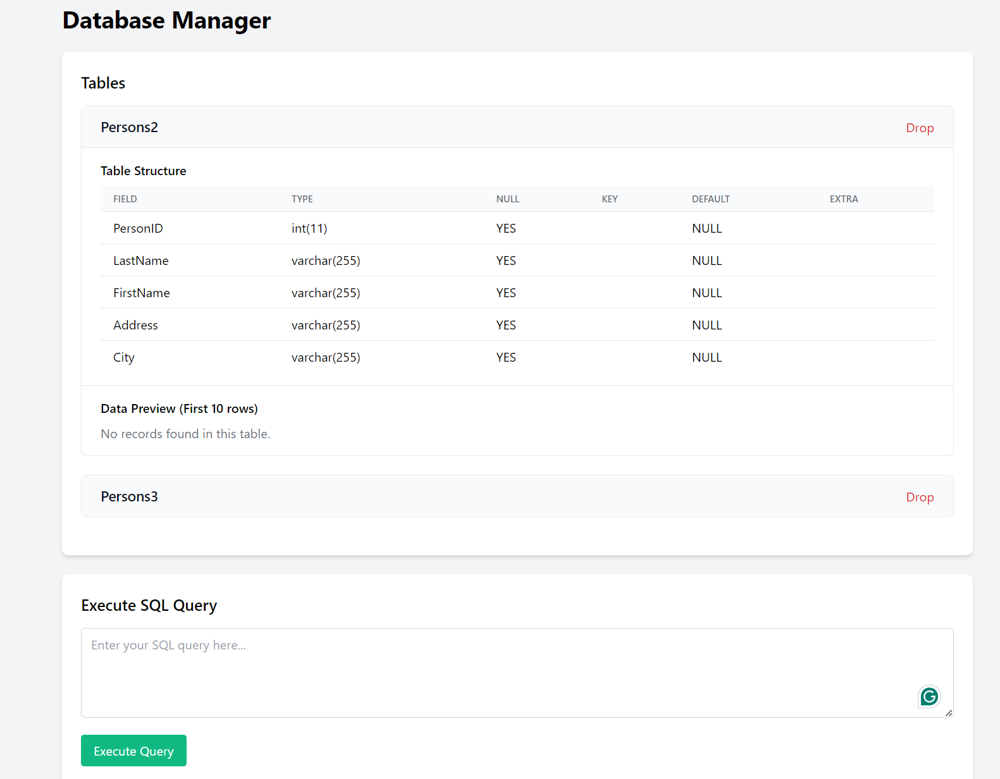
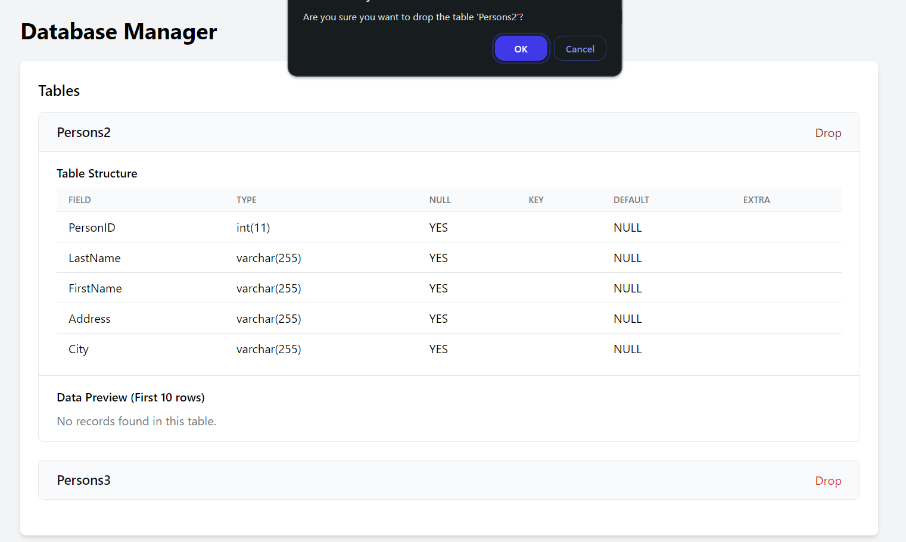

# Basic Remote MySQL Database Manager

A lightweight, secure, and user-friendly web application for managing remote MySQL databases. Built with PHP and styled with Tailwind CSS, this tool allows you to perform database operations remotely with a clean and modern interface.


## Features

- 🔍 View all database tables and their structure
- 📊 Preview table data (first 10 rows)
- ⚡ Execute custom SQL queries
- 📁 Upload and execute SQL files
- 🗑️ Drop tables with confirmation
- 🛡️ Secure database connection handling
- 📱 Responsive design with Tailwind CSS

## Project Structure

```
Basic-Remote-MYSQL-Database-Manager/
├── index.php              # Main interface and request handler
├── db-connection.php      # Database connection configuration
├── DatabaseManager.php    # Database operations handler
└── screenshots/          # Application screenshots
```

## Setup Instructions

1. Clone the repository:
```bash
git clone https://github.com/yourusername/Basic-Remote-MYSQL-Database-Manager.git
```

2. Configure your database connection in `db-connection.php`:
```php
$this->config = [
    'host' => "your_database_host",
    'username' => "your_username",
    'password' => "your_password",
    'database' => "your_database_name",
    'charset' => "utf8mb4"
];
```

3. Make sure you have:
   - PHP 7.4+ installed
   - MySQL/MariaDB server running
   - Web server (Apache/Nginx) configured

4. Access the application through your web browser:
```
http://localhost/Basic-Remote-MYSQL-Database-Manager/
```

## Screenshots

### Table List and Structure


### SQL Query Execution

## 🚀 Roadmap

Here are the planned features for future releases:

1. **User Authentication System**
   - Login/Register functionality
   - Role-based access control (Admin, Developer, Viewer)
   - Password reset and email verification

2. **Database Backup & Restore**
   - Scheduled automatic backups
   - One-click database backup
   - Import/restore from backup files
   - Backup history management

3. **Advanced Query Tools**
   - Query history with search
   - Save favorite queries
   - Query templates for common operations
   - Query performance analysis

4. **Table Management Enhancements**
   - Visual table creator/editor
   - Bulk data import/export (CSV, JSON, XML)
   - Table relationships visualization
   - Foreign key constraint manager

5. **Real-time Collaboration**
   - Multiple user sessions
   - Query sharing between users
   - Real-time query results
   - Activity logging

6. **Advanced Security Features**
   - IP whitelist/blacklist
   - Two-factor authentication
   - Query execution limits
   - Audit logging

7. **Database Monitoring**
   - Server status dashboard
   - Performance metrics
   - Query execution time tracking
   - Resource usage statistics

8. **API Integration**
   - RESTful API endpoints
   - API key management
   - Swagger documentation
   - Rate limiting

9. **Data Analysis Tools**
   - Basic data visualization
   - Export charts and graphs
   - Custom report generator
   - Scheduled reports

10. **Multi-database Support**
    - Connect to multiple databases
    - Database comparison tools
    - Cross-database queries
    - Database migration tools

Each feature will be developed with security, performance, and user experience in mind. Contributions and suggestions are welcome!

## Security Considerations

- ⚠️ Always use strong passwords for database access
- 🔒 Configure your MySQL server to accept connections only from trusted hosts
- 🛡️ Keep your PHP and MySQL installations up to date
- 📝 Regularly backup your database
- 🔐 Use prepared statements for queries (implemented in the code)

## Features in Detail

### Table Management
- View all tables in the database
- See detailed table structure (columns, types, keys)
- Preview table data
- Drop tables with confirmation dialog

### Query Execution
- Execute any valid SQL query
- View query results in a formatted table
- Error handling with clear messages
- Support for multiple queries

### File Upload
- Upload and execute SQL files
- Support for large SQL files
- Error handling for upload issues
- Success/failure notifications

## Contributing

Feel free to fork this project and submit pull requests. You can also open issues for bugs or feature requests.

## Author

**Yiğit Ali Demir**
- GitHub: [github.com/jpntr](https://github.com/jpntr)
- Twitter: [x.com/jpntr26](https://x.com/jpntr26)
- Website: [yigitali.com](https://yigitali.com)

## License

This project is licensed under the MIT License - see the [LICENSE](LICENSE) file for details.